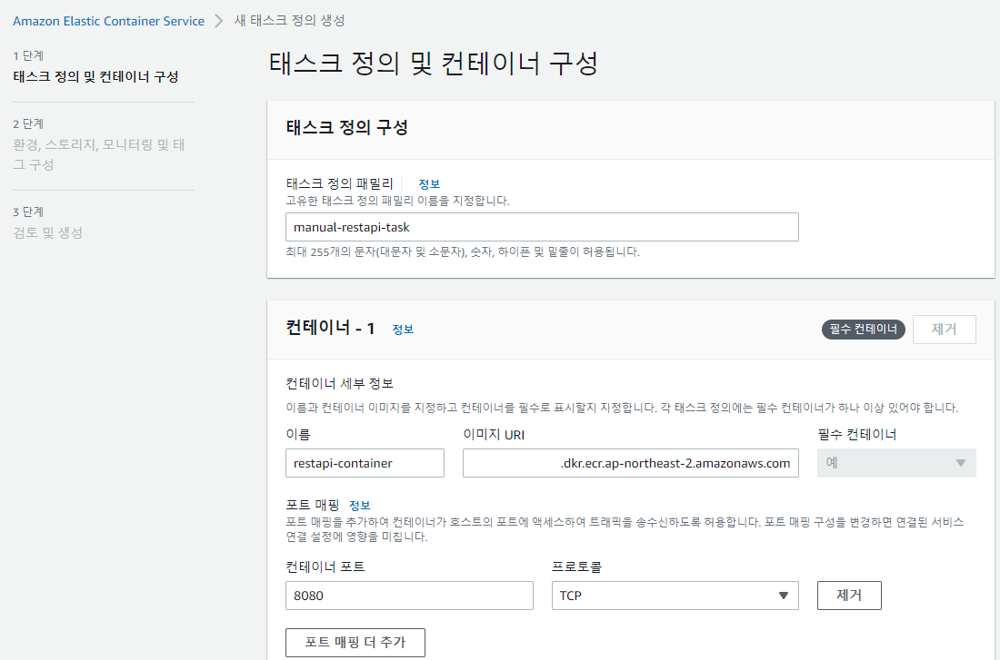

# ECS Service 생성

## 개요

ECS 서비스를 직접 배포합니다.

## 실습

* 좌측 메뉴의 태스크 정의를 누른 뒤, 우측의 새 태스크 정의 생성 버튼을 클릭합니다.

.png>)

* 태스크 정의 패밀리 이름, 컨테이너 이름을 지정합니다. 이미지 URI는 ECR Container Image 생성당시 이미지 URI값을 복사해둔 것을 기입합니다. 컨테이너 포트는 8080으로 변경합니다. 나머지 설정값은 변경하지 않고 다음 을 누릅니다.

* 앱 환경은 EC2 인스턴스, 운영체제/아키텍처는 Linux/X86\_64, 태스크 크기는 1 vCPU, 1 GB로 설정합니다. 태스크 역할은 IAM 생성때 만들었던 ECSDefaultTaskRole을 선택합니다. 나머지 설정값은 변경하지 않고 다음 을 누릅니다.

.png>)

* 입력한 값이 맞는지 확인 후 생성 버튼을 누릅니다.

.png>)

* 새 태스크가 생성되었습니다. 하지만&#x20;

.png>)

* 클러스터 메뉴로 돌아가서 manual-ecs-ec2 클러스터를 선택합니다. 서비스탭에서 배포를 클릭합니다.

.png>)

* 컴퓨팅 옵션을 용량공급자 전략으로 선택합니다. 용량 공급자의 경우 초기 FARGATE로 되어있지만 EC2CapacityProvider 텍스트를 포함한 값을 선택합니다. 기본값은 0, 가중치는 1입니다.

.png>)


용량 공급자의 정확한 값은 클러스터 선택후 인프라 탭을 클릭하면 보실 수 있습니다.


* 배포구성에서 어플리케이션 유형은 서비스를 선택합니다. 패밀리의 빈 콤보박스를 누르면, 태스크를 정의할때 생성한 manual-restapi-task 값이 보입니다. 서비스 이름은 manual-restapi-service, 원하는 태스크는 2입니다. 배포옵션은 변경하지 않습니다.

 (3).png>)

* 로드밸런서를 새로 생성합니다. 배포버튼을 누르면 배포가 시작됩니다.

.png>)

*

